# Creating the Azure Function in the Azure Web Portal

In this section, we will build the Azure Functions application in the Azure web portal and then add an HTTP Triggered function. This will allow us to call the function from the Xamarin client, for example with an [HttpClient](http://gslb.ch/a75) instance.

> Note: If you prefer, you can create the Azure Function in Visual Studio 2017 instead. [A detailed tutorial can be found here](./creating-vs.md).

To create the Azure Functions application in the Azure portal, follow these steps:

1. Log into the [Azure Portal](http://portal.azure.com) with your user account.

> Note: You will need an Azure account to create this sample. If you don't have one already, [you can get a free trial account here](http://gslb.ch/a17).

2. Click the "Create a resource" menu item.

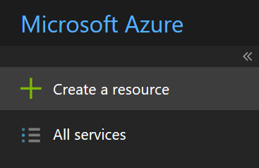

3. In the Azure Marketplace, select "Serverless Function App".

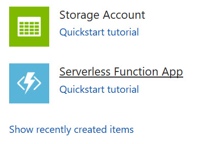

4. Fill the form with the following data:

    - App Name: This is a unique name for your application. One application can contain multiple functions.

    - Subscription: The subscription to which these functions will be billed. In some cases you will only see one subscription here, but some people have multiple subscriptions associated to their account.

    - Resource group: This is a logical grouping of Azure resources. It makes sense to have one resource group per application, so you can easily locate the resources that you are using. In this case we are creating a new resource group for this application.

    -  OS: The operating system of the server on which the functions will run.

    - Hosting plan: This shows how the function usage will be billed.
        - Consumption plan means that the function will be billed whenever it is called, and only for the time that it runs. This is the best plan to get started.
        - App Service Plan is best after your business starts attracting more users and you need some more predictable billing.

    - Location will be the physical location of the server on which your functions will run. You should choose a server close to your users.

    - Storage: You can either create a new storage account, or use an existing one. Note that this sample doesn't use storage but you still need to specify a storage account.

    > Note: The storage account name should be entered in lower case.

    - Application Insights: If you want to add extra analytics on your functions application, you can switch this on. This provides you with stats about the usage, crash reports, custom events, etc. In this sample we will not use Application Insights.

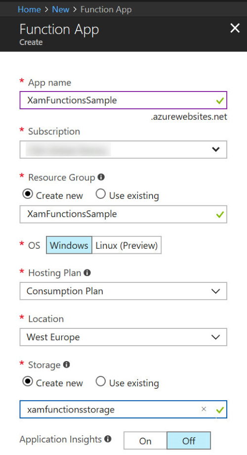

5. Click the Create button. This will trigger the deployment, and you should see a popup like shown below.

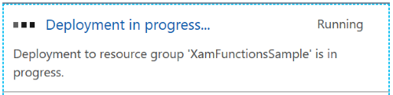

6. After a moment, you should see a new notification: Deployment succeeded. You can then click the button to go to the resource, or simply close the notification.

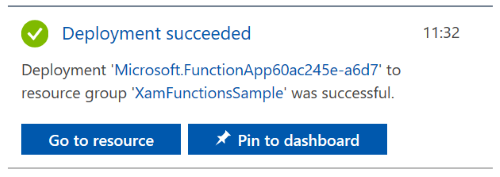

> Note: You can always go back to the application by clicking on the Function Apps menu item on the left-hand side.

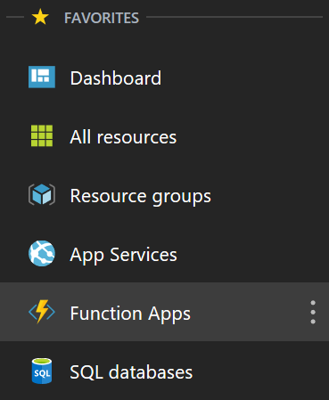

7. Once you are in the Functions Apps section in the portal, expand the application itself. Next to the "Functions" submenu, click on the "+" sign when you hover over the submenu.

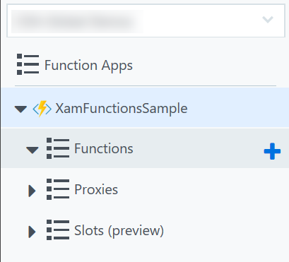

Now we need to choose what will *trigger* the function that we will create. There are a large number of triggers available and we cannot review all of them here, but there is [documentation available on our Docs website](http://gslb.ch/a63). The most common triggers are:

- [HTTP Trigger](http://gslb.ch/a65): The function will be executed when an HTTP request arrives. This is the type of trigger we will use.
- [Timer trigger](http://gslb.ch/a66): The function is executed every interval of time, where the interval is specified [by a CRON expression](https://en.wikipedia.org/wiki/Cron#CRON_expression).
- [Blob trigger](http://gslb.ch/a64): The function is executed when a file is uploaded to a given blob container
- [and more...](http://gslb.ch/a63)

8. Click on the "Custom function" button as shown below.

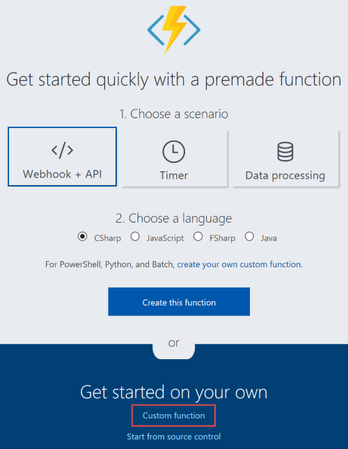

9. You will now see a large list of potential triggers, which can be implemented in various languages. Scroll down until you see the "HTTP trigger with parameter". In this sample, we will create the function in C#, so click the corresponding button.

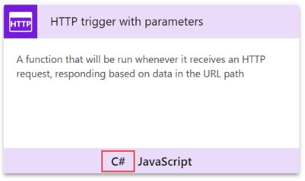

10. Enter a name for the function (for example "Add") and press Create.

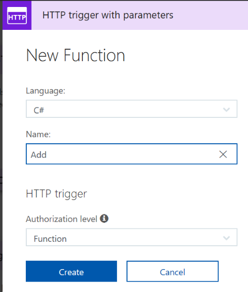

11. The function is created, and some basic implementation is added. Let's test to see how the function works. Since it is an HTTP trigger, we can execute the function by calling a URL. You can get the URL from the top right corner, where the "Get function URL" button is found.

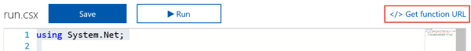

12. Copy the URL from the popup window.

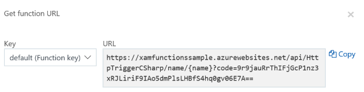

13. Open a web browser window and paste the link into the location bar. Before you press the Enter key, make sure to replace the ```{name}``` parameter in the URL with your own name. Then press enter and you should see the response "Hello Laurent" appear (except that your own name should be shown instead of Laurent).

## Conclusion

We now have the infrastructure in place for our Azure Function. Once you are a bit more experienced, the process of creating such a function should not take more than a few minutes. 

[In the next section, we will now modify the function's interface and then implement it.](./implementing.md)