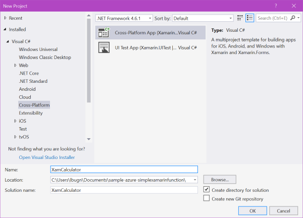
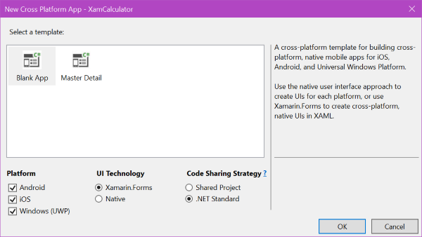
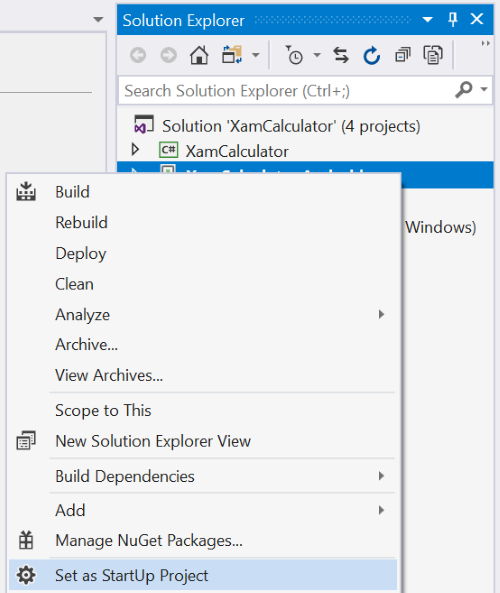
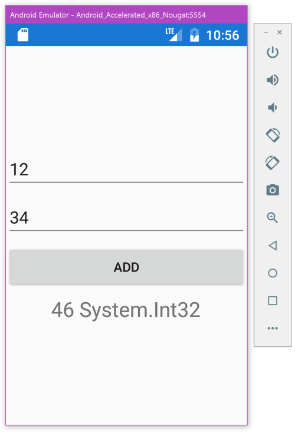

# Implementing the first version of the Xamarin.Forms client app

We will start this sample by creating a Xamarin.Forms client app which works offline. Then we will see how we can transfer the business logic of this app to the Azure cloud.

> Note: If you are already familiar with Xamarin.Forms, you can jump to the next step without fear. You will find the client that we create in this page in [the XamCalculator - Start folder](https://github.com/lbugnion/sample-azure-simplexamarinfunction/tree/master/XamCalculator%20-%20Start).

The Xamarin client app that we create here is extremely simple and obviously not a real life scenario. However it shows all the steps necessary to creating the client and the server applications, and it should give you a good jumpstart into your own projects and use cases.

1. In Visual Studio 2017, select File > New > Project.

> Note: We use Visual Studio 2017 on Windows for this sample, but you can also create Xamarin.Forms applications in Visual Studio for Mac if you prefer. Xamarin is available for free in all editions of Visual Studio, including the free Community edition, on PC and Mac.
> - [Visual Studio Community Edition for Windows](http://gslb.ch/a72)
> - [Visual Studio for Mac](http://gslb.ch/a73)

2. In the New Project dialog, select the Cross-Platform category, and then Cross-Platform App (Xamarin.Forms) with Visual C#. Name the new application ```XamCalculator```, select a location for the project and press OK.



> Note: The Cross-platform category is available if you selected the "Mobile development with .NET" workload in the Visual Studio 2017 installer.

3. In the New Cross Platform App dialog, select the following settings, then press OK.
    - Android, iOS and Windows
    - Xamarin.Forms
    - .NET Standard



The new application consists of 4 projects:

- XamCalculator: This is the shared .NET Standard project, where we will implement the UI and the code calling the function. This project is referenced by each of the 3 other projects.
- XamCalculator.Android: The Android version of the application.
- XamCalculator.iOS: The iOS version of the application.
- XamCalculator.UWP: The Universal Windows Platform (UWP) of the application.

Later we will see how we can select each application to test it and run it.

4. In the XamCalculator project, select the MainPage.xaml and open it in the editor.

5. Replace the existing XAML with the following:

```xml
<?xml version="1.0" encoding="utf-8" ?>
<ContentPage xmlns="http://xamarin.com/schemas/2014/forms"
             xmlns:x="http://schemas.microsoft.com/winfx/2009/xaml"
             xmlns:local="clr-namespace:XamCalculator"
             x:Class="XamCalculator.MainPage">

    <StackLayout VerticalOptions="Center"
                 HorizontalOptions="Fill">

        <Entry x:Name="Number1"
               Placeholder="Enter the first integer"
               PlaceholderColor="Gray" />

        <Entry x:Name="Number2"
               Placeholder="Enter the second integer"
               PlaceholderColor="Gray" />

        <Button Text="Add"
                x:Name="AddButton" />

        <Label x:Name="Result"
               FontSize="Large"
               HorizontalOptions="Center"
               Text="Ready for operation" />

    </StackLayout>
</ContentPage>
```

The code above creates a new user interface with 4 UI elements placed under each other. The layout is performed by the ```StackLayout``` panel. By default, the StackLayout uses a vertical layout, but it could also be changed to horizontal if needed. [There are many other layout types](http://gslb.ch/a67) that can be used to create more complex layouts.

- The first and second UI elements are [Entry controls](http://gslb.ch/a68) where the user will be able to enter some text. We will access this text from the code behind. Note how we use the [Placeholder property](http://gslb.ch/a69) to show a placeholder text when the field is empty. The controls are named ```Number1``` and ```Number2```.

- The third element is a [Button control](http://gslb.ch/a70). This control can be clicked by the user, which will create an event that we will respond to. The button is named ```AddButton```.

- The last element is a [Label control](http://gslb.ch/a71), used to show some simple text output to the user. The Label is named ```Result```.

6. Open the MainPage.xaml.cs now. This C# code file is what we call "code behind". This is the view's controller, where we will handle events and modify the UI accordingly.

7. Modify the MainPage class to look like this:

```CS
public partial class MainPage : ContentPage
{
    public MainPage()
    {
        InitializeComponent();

        AddButton.Clicked += async (s, e) =>
        {
            int number1 = 0, number2 = 0;

            var success = int.TryParse(Number1.Text, out number1)
                && int.TryParse(Number2.Text, out number2);

            if (!success)
            {
                await DisplayAlert(
                    "Error in inputs", 
                    "You must enter two integers", "OK");
                return;
            }

            var result = number1 + number2;
            Result.Text = result + $" {result.GetType()}";
        };
    }
}
```

Let's review the code above:

- In the ```MainPage``` constructor, we handle the Clicked event of the Button control. When this event is called, the event handler will be executed.

- We parse the text that the user entered. We want to make sure that we send integers to the server, to avoid error there. Parsing the text with the ```TryParse``` method ensures that the user input is suitable.

- If the user enters incorrect inputs, we show a warning message and we stop the execution.

- If the user input is correct, we perform the addition.

- Finally, we show the result to the user, as well as the type of the result.

Now we can test the application and see if it works as expected.

## Testing the app

You can run and test the application on an emulator/simulator, or on a device directly.

### On Android

For example, here is how you can test the app on Android:

1. Right-click on the Android application and select "Set as Startup Project".



2. Make sure that an emulator is selected in the Run dropdown.


3. Press the Run button to debug the code.

4. In the emulator window, enter two operands and press the Add button. After a short wait, you should see the result.



### On iOS and Windows

You can of course also test on iOS and Windows. To do this [you can follow the steps described here](./second-client.md#testing-the-client-app). The result you will see should be very similar to what you see on Android.

## Conclusion

Our "offline" client app works great, but now is the time to leverage the power of the cloud. Of course for this extremely simple sample, putting code in the cloud makes literally no sense. However there are many other scenarios where leveraging Azure is a great idea:

- You can take advantage of a server to process calculations that would be too complex or too slow on a mobile client.

- You can have one server processing the code and caching the results instead of thousands of mobile clients, thus saving resources.

- and dozens more reasons.

We will now show you how to create an Azure Functions app ([in the Azure portal](./creating.md) or [in Visual Studio 2017](./creating-vs.md)), move the business logic code from the Xamarin client app to the cloud, and then [modify the Xamarin client app](./second-client.md) to use this new online resource.