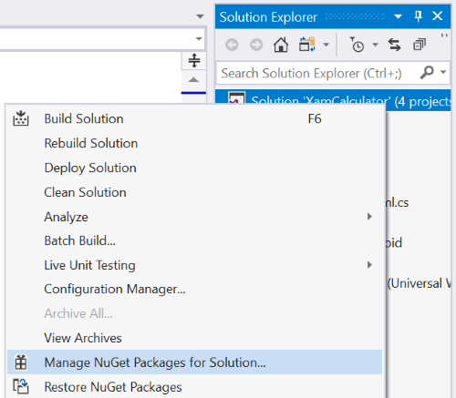
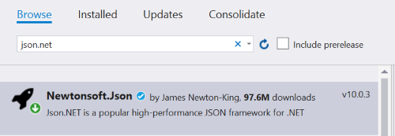
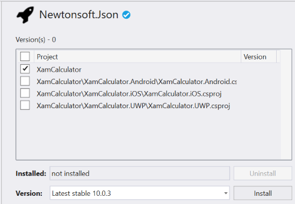
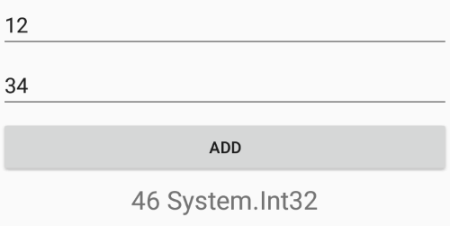

# Refactoring the Xamarin client app to use JSON

The function is now returning a JSON-formatted string. Thankfully parsing JSON in C# is extremely easy with the help of the [JSON.NET Nuget package](https://www.nuget.org/packages/Newtonsoft.Json). In this section, we will add the Nuget package to our Xamarin application, and then modify the code slightly to take advantage of this package and deserialize the JSON result.

1. Open the XamCalculator solution in Visual Studio.

2. In the Solution Explorer, right-click on the XamCalculator solution and select "Manage Nuget Packages for Solution" from the context menu.



3. Make sure that Browse is selected and type ```json.net``` in the search box.

4. Select Newtonsoft.Json from the list.



5. On the right hand side, make sure to select the XamCalculator project and click on the Install button. If needed, accept the license.



## Adding the class library

When we modified the server side code, we added a portable class library (PCL) to the Azure Functions application and stored the object code into this library. This will allow us to easily reuse this code in the client application too. 

1. In the Solution Explorer, right click on the XamCalculator solution and select Add, Existing Project from the context menu.

2. Navigate to the Calculator.Data project that we created earlier. You need to locate the file Calculator.Data.csproj and select it in the dialog.

3. Right click on the XamCalculator project (not the Solution but the main project of the Xamarin.Forms application) and select Add, Reference from the context menu.

4. In the Reference Manager dialog, select the Calculator.Data project and click on OK.

5. Open the file MainPage.xaml.cs and update the code of the try/catch block as follows. Note that nothing else changes in the client application!

```CS
try
{
    var url = Url.Replace("{num1}", number1.ToString())
        .Replace("{num2}", number2.ToString());

    var json = await Client.GetStringAsync(url);

    var deserialized = JsonConvert.DeserializeObject<AdditionResult>(json);

    Result.Text = deserialized.Result + $" {deserialized.Result.GetType()}";
}
catch (Exception ex)
{
    error = ex;
}
```

The changes to the client application are very minor: We use exactly the same URL with the two operands. What we get from the service is now a JSON-formatted string. 

The next step is to deserialize the JSON into an instance of the ```AdditionResult``` class. This is the exact same class that we used on the server. The JSON format is only used for the HTTP transport. 

Finally, we use the ```Result``` property of the ```AdditionResult``` class. You can now test the application again in iOS, Android or in Windows 10 UWP (following [the instructions we used earlier](./first-client.md#testing-the-client-app)). For example, here is the application running in the Android emulator:



Note how the ```Result``` property is now of type ```System.Int32``` instead of ```System.String``` like before. Also, we can pass multiple values from the server to the client, and easily add properties to the ```AdditionResult``` class if needed for new features of the application.

## Conclusion

At this point, we have an Azure Functions application with one HTTP endpoint, and a Xamarin.Forms app running on iOS, Android and Windows 10. The server and the client use JSON to communicate. Modifying and extending the application for your own usage should be straightforward.

This concludes this sample. We hope that you found this code and tutorial useful. Please don't hesitate to enter comments and questions in the Issues tab above. You can also contact me privately but I prefer to keep the discussion in the open, so everyone can see the answers. 

Happy coding!

[Laurent](https://twitter.com/lbugnion)