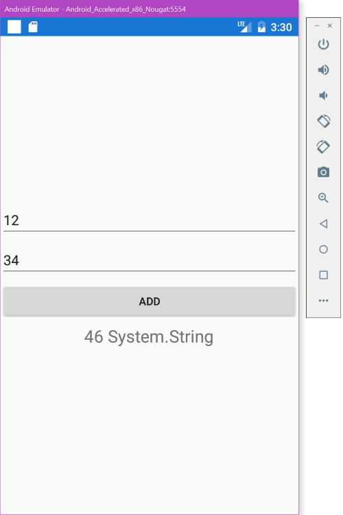
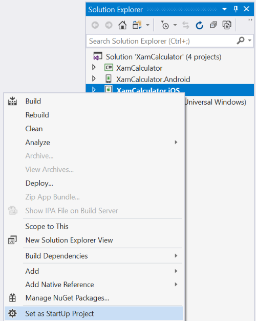
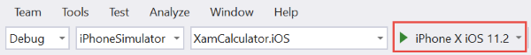
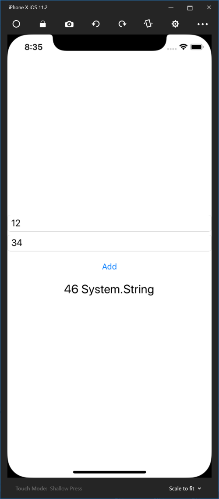
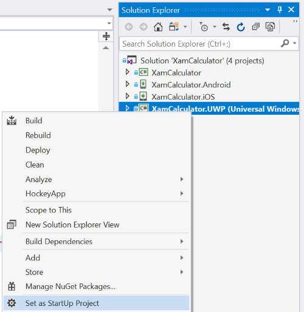
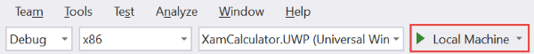
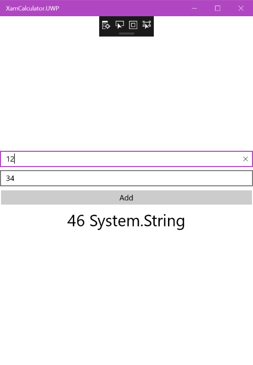

# Modifying the Xamarin.Forms client to use the Azure Function

We know that our function works well now, because we tested it [in the Azure Portal](./implementing.md#testing-the-new-signature) and [in Visual Studio 2017](./creating-vs.md#testing-the-function). Now we will build a Xamarin.Forms client app that runs on iOS, Android and Windows to use this new function.

In the previous step, we copied the function's URL for later usage. Make sure to keep this URL handy, we will need it later in the client's code.

- [Copying the URL when creating the Function in the Azure Portal](./implementing.md#getting-the-url-for-the-xamarin-client)
- [Copying the URL when creating the Function in Visual Studio 2017](./creating-vs.md#getting-the-url-for-the-xamarin-client-app)

1. Open the previous state of the Xamarin client app XamCalculator. If you skipped building the offline client, [you can get the application from here](https://github.com/lbugnion/sample-azure-simplexamarinfunction/tree/master/XamCalculator%20-%20Start).

2. Open the MainPage.xaml.cs file.

3. Replace the ```MainPage``` constructor with the following code:

```CS
public partial class MainPage : ContentPage
{
    private const string Url = "YOUR URL HERE";

    private HttpClient _client;

    private HttpClient Client
    {
        get
        {
            if (_client == null)
            {
                _client = new HttpClient();
            }

            return _client;
        }
    }

    public MainPage()
    {
        InitializeComponent();

        AddButton.Clicked += async (s, e) =>
        {
            int number1 = 0, number2 = 0;

            var success = int.TryParse(Number1.Text, out number1)
                && int.TryParse(Number2.Text, out number2);

            if (!success)
            {
                await DisplayAlert("Error in inputs", "You must enter two integers", "OK");
                return;
            }

            Result.Text = "Please wait...";
            AddButton.IsEnabled = false;
            Exception error = null;

            try
            {
                var url = Url.Replace("{num1}", number1.ToString())
                    .Replace("{num2}", number2.ToString());
                var result = await Client.GetStringAsync(url);
                Result.Text = result + $" {result.GetType()}";
            }
            catch (Exception ex)
            {
                error = ex;
            }

            if (error != null)
            {
                Result.Text = "Error!!";
                await DisplayAlert("There was an error", error.Message, "OK");
            }

            AddButton.IsEnabled = true;
        };
    }
}
```

What the code above does is the following:

- We define a constant for the URL template for the service. You should replace the words ```YOUR URL HERE``` with the URL that you copied in the previous step.

- We define an ```HttpClient``` as a property so that we can easily reuse it. Like the name suggests, the ```HttpClient``` is a class designed for interaction with servers over HTTP. It is the most convenient and simple way to access an HTTP service, such as our HTTP-Triggered function. 

- In the ```MainPage``` constructor, we handle the Clicked event of the Button control. When this event is called, the event handler will be executed.

- We parse the text that the user entered. We want to make sure that we send integers to the server, to avoid error there. Parsing the text with the ```TryParse``` method ensures that the user input is suitable.

- If the user enters incorrect inputs, we show a warning message and we stop the execution.

- We show a message to the user saying ```Please wait```. This is because we will perform an asynchronous operation that could take a moment, and it is nice to let the user know what's happening. On the next line, we also disable the ```AddButton``` to avoid that the user presses the button again while the operation is active.

The next execution block is placed in a ```try/catch``` so that we catch any potential error and inform the user accordingly. The ```HttpClient``` may throw an exception if the server is down, or if there is a server error for example. If such an exception occurs, we need to make sure that the application doesn't crash, and that the user knows what happened.

- We create the URL out of the URL template declared as a constant higher up. In this URL, the first and second numbers are defined as ```{num1}``` and ```{num2}```. 

- The next line is the call to the ```GetStringAsync``` method of the ```HttpClient```. This method is asynchronous, like the name suggests. This is why we use the ```await``` keyword when we call it. 

> Note: Calling the method with the ```await``` keyword does not block the method's execution. It means that the user interface will remain usable. This is why informing the user is important.

- If everything works well, we show the result of the operation to the user. In this sample I am also showing the type of the result, which is a string (as returned by the web service). [Later we will see how we can modify this part](./refactoring-client.md) to make it more convenient to use.

- Outside of the try/catch block, we check if there was an error. Note that you cannot use DisplayAlert asynchronously from within the ```catch``` block because the ```await``` keyword is not allowed there. This is why we saved the potential error, and later we check if there was an error, and show the message to the user if needed.

- Finally, we re-enable the ```AddButton``` so the user can try another operation.

## Testing the client app

Time to test the new client which connects to the Azure Function! Again you can test on emulator/simulator, or you can deploy on a real device if you prefer.

### Testing on Android

Here is how you can test the app on Android:

1. Right-click on the Android application and select "Set as Startup Project".


2. Make sure that an emulator is selected in the Run dropdown.


3. Press the Run button to debug the code.

4. In the emulator window, enter two operands and press the Add button. After a short wait, you should see the result.



### Testing on iOS

On iOS you can run the app in the iOS simulator to test it.

1. Right-click on the iOS application and select "Set as Startup Project".



2. Make sure that "iPhoneSimulator" and a simulator are selected in the toolbar.



3. Press the Run button to debug the code.

4. In the simulator window, enter two operands and press the Add button. After a short wait, you should see the result.



### Testing on Windows (UWP)

To test on Windows 10, you can run the application on the local machine directly from Visual Studio 2017.

1. Right-click on the UWP application and select "Set as Startup Project".



2. Make sure that x86 and Local Machine are selected in the toolbar.



3. Press the Run button to debug the code.

4. In the window that opens up, enter two operands and press the Add button. After a short wait, you should see the result.



## Conclusion

We have now tested that the application works well. However using simple text to communicate between the server and the client is not very flexible. Adding new properties to the interface would be quite complex. To solve this, we will now refactor [the Azure Function](./refactoring.md) and [the Xamarin client app](./refactoring-client.md) to use the JavaScript Object Notation JSON instead.